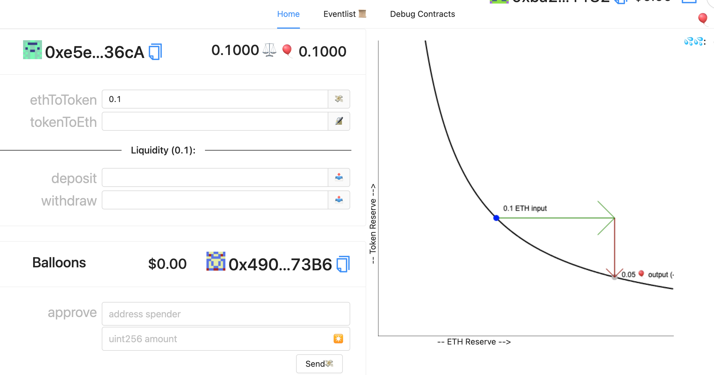

`yarn start` (react app frontend)

`yarn chain` (hardhat backend)

`yarn deploy` (to compile, deploy, and publish your contracts to the frontend)

 `yarn deploy` whenever you want to deploy new contracts to the frontend (run `yarn deploy --reset` for a completely fresh deploy if you have made no contract changes).

`Balloons.sol` is just an example ERC20 contract that mints 1000 $BAL to whatever address deploys it.

`DEX.sol` is what we will build in this challenge and you can see it starts with a SafeMath library to help us prevent overflows and underflows and also tracks a token (ERC20 interface) that we set in the constructor (on deploy).

